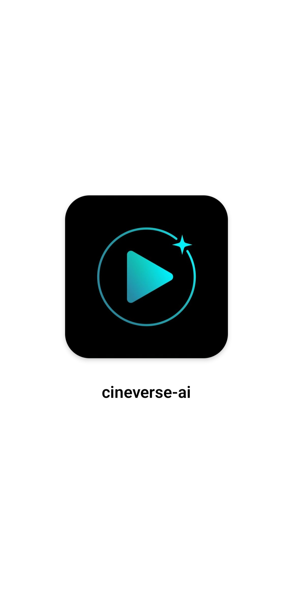
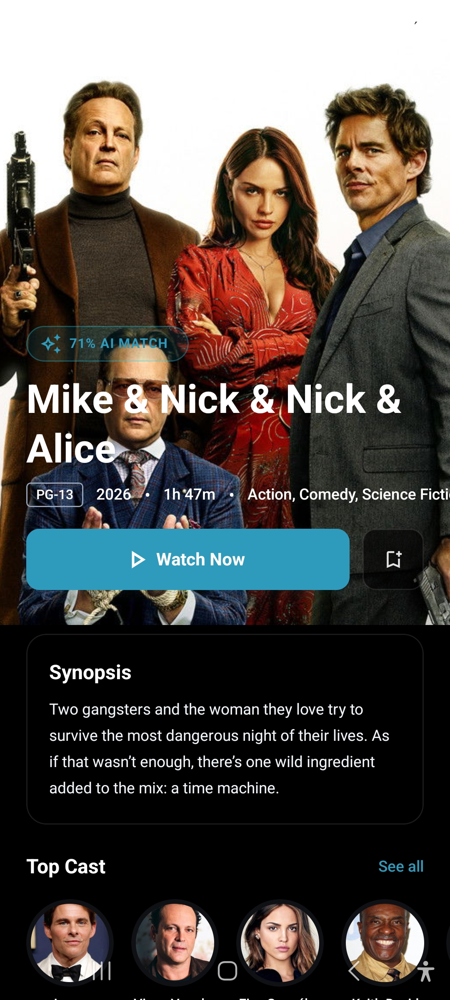
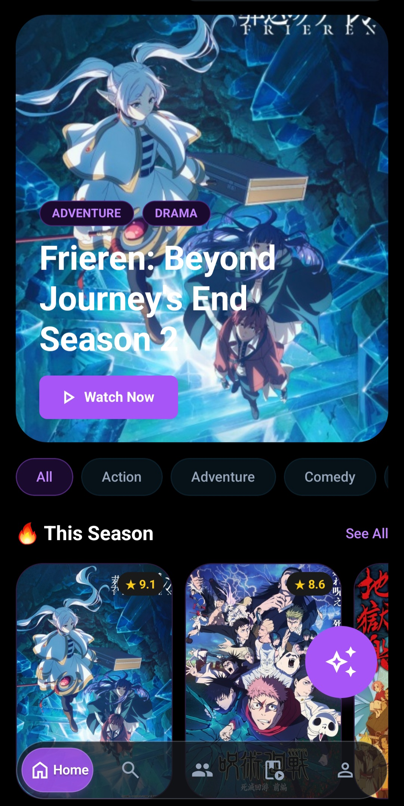
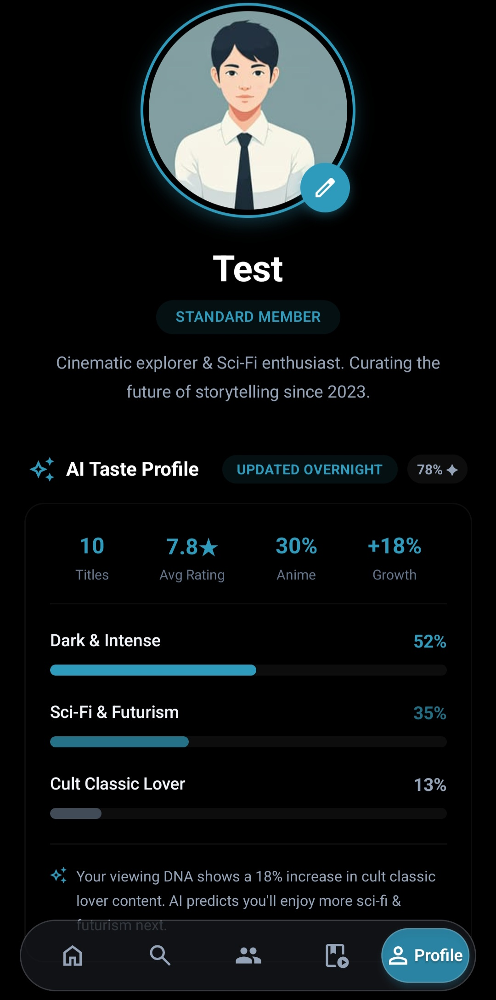
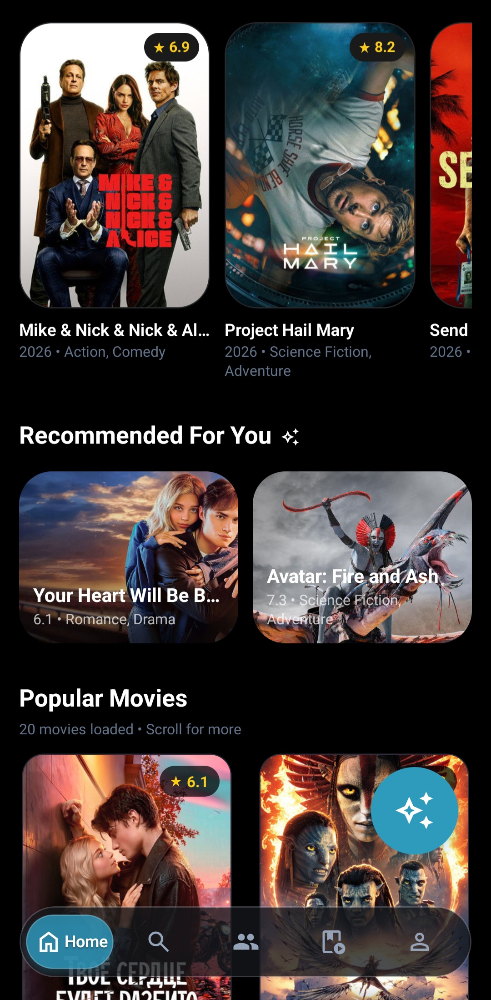
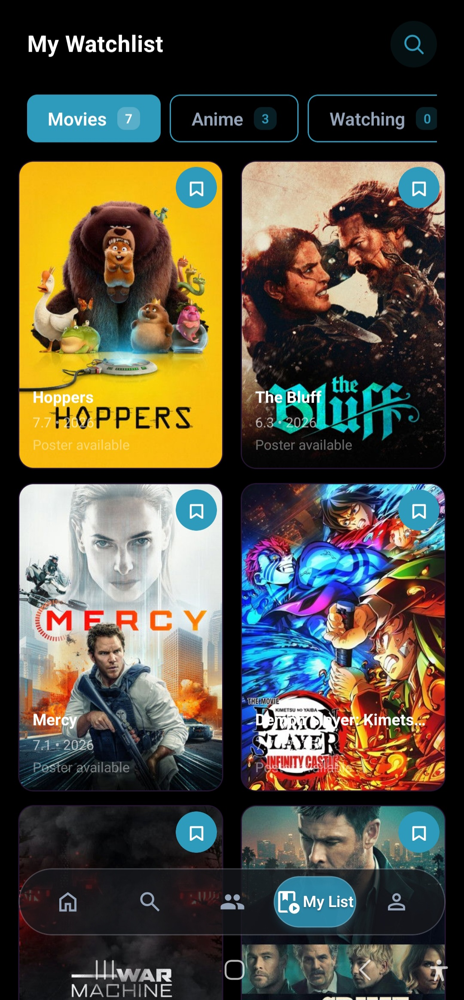

<div align="center">


# CineVerse AI

### Your AI-Powered Entertainment Companion

**Discover movies & anime through intelligent recommendations and social connections**

[![Expo][expo-badge]][expo-url]
[![React Native][rn-badge]][rn-url]
[![TypeScript][ts-badge]][ts-url]
[![Appwrite][appwrite-badge]][appwrite-url]
[![License][license-badge]](LICENSE)

[Features](#-features) • [Screenshots](#-screenshots) • [Architecture](#-architecture) • [Tech Stack](#-tech-stack) • [Getting Started](#-getting-started)

</div>

---

## 📱 About

**CineVerse AI** is a beautifully designed, cross-platform entertainment discovery app that combines **AI-powered recommendations** with **social features** to create the ultimate movie and anime companion. Built with React Native and Expo, it delivers a native experience on iOS, Android, and Web from a single codebase.

### 🎯 Key Highlights

| Feature | Description |
|---------|-------------|
| 🤖 **AI Recommendations** | Natural language queries powered by Google Gemini with intelligent fallback |
| 🎬 **Dual Content Mode** | Seamlessly switch between Movies and Anime |
| 🎥 **Video Trailers** | Auto-playing YouTube trailers in hero sections |
| 👥 **Social Features** | Activity feed, follow system, user discovery |
| ⭐ **Reviews & Ratings** | Community-driven review system with engagement |
| 🔍 **Advanced Filters** | Year, genre, rating, language, and more |
| 📚 **Watchlist** | Track what you're watching with status management |
| 🌙 **Cinematic Dark UI** | Immersive dark theme with smooth animations |

---

## ✨ Features

### 🎬 Movie Discovery

- **Trending Movies** - Real-time trending content from TMDB
- **Now Playing** - Currently in theaters
- **Popular & Top Rated** - Curated collections
- **Upcoming** - Anticipated releases
- **Video Trailers** - YouTube trailers auto-play in hero

### 🌸 Anime Discovery

- **Seasonal Anime** - Current season's top anime
- **Top Rated** - All-time best anime
- **Detailed Info** - Synopsis, episodes, status, studios

### 🤖 AI-Powered Recommendations

```
"Something like Inception but more recent"
"Feel-good movies for a Sunday afternoon"
"Mind-bending thrillers that will blow my mind"
```

- Natural language processing
- Match percentage for each recommendation
- "Surprise Me" random prompt feature
- Quick suggestion chips
- Multi-provider support (Gemini, Ollama)

### 🔍 Advanced Search & Filters

| Filter | Options |
|--------|---------|
| **Year** | 1975 - 2026 |
| **Genre** | Multi-select from all genres |
| **Rating** | Minimum rating threshold |
| **Sort By** | 8 options (popularity, rating, date, etc.) |
| **Language** | Original language filter |
| **Adult Content** | Toggle visibility |

### 👥 Social Features

- **Activity Feed** - See what friends are watching
- **Follow System** - Build your community
- **User Profiles** - Stats, reviews, activity history
- **User Discovery** - Find users with similar tastes

### ⭐ Reviews & Ratings

- 5-star rating system
- Written reviews with engagement
- Like system for helpful reviews
- Sort by recent or popular
- Average community ratings

### 📚 Watchlist Management

- **Status Tracking** - Watching, Completed, Plan to Watch
- **Quick Actions** - Add/remove with one tap
- **Personal Collections** - Organize your content

---

## 📸 Screenshots

<div align="center">

### 🏠 Home & Discovery

| Home - Movies | Home - Movie | Home - Anime | AI Recommendations |
|:-------------:|:------------:|:--------:|:------------------:|
|  |  |  |  |

### 🎯 Features

| Social Feed | Filters | Watchlist | Movie Details |
|:-----------:|:-------:|:---------:|:--------------:|
|  |  |  |  |

### 📱 More Screens

| Profile | Login | Trailer Playback | Anime Details |
|:-------:|:-----:|:----------------:|:-------------:|
| |  |  |  |

</div>

> 📝 **Note:** Add your screenshots to the `screenshots/` directory with the filenames above to display them in the README.

---

## 🏗️ Architecture

### Project Structure

```
├── app/                          # Expo Router (file-based routing)
│   ├── (tabs)/                   # Bottom tab navigation
│   │   ├── index.tsx             # Home screen (Movies/Anime toggle)
│   │   ├── discover.tsx          # Search & discovery
│   │   ├── social.tsx            # Activity feed
│   │   ├── watchlist.tsx         # Personal watchlist
│   │   └── profile.tsx           # User profile
│   ├── aiscreen/                 # AI recommendation chat
│   ├── movies/[id].tsx           # Movie detail screen
│   ├── anime/[id].tsx            # Anime detail screen
│   ├── reviews/[movieId].tsx     # Reviews screen
│   ├── authscreen/               # Authentication screens
│   └── player/[id].tsx           # Video player
├── components/                   # Reusable UI components
│   └── FilterModal.tsx          # Advanced filter modal
├── contexts/                     # React Context providers
│   ├── AuthContext.tsx           # Authentication state
│   ├── SocialContext.tsx         # Social features
│   ├── ReviewsContext.tsx        # Reviews system
│   ├── CollectionsContext.tsx    # Collections management
│   └── ThemeModeContext.tsx      # Theme management
├── lib/                          # Utilities & API clients
│   ├── ai/                       # AI service integration
│   ├── tmdb.ts                   # TMDB API client
│   ├── jikan.ts                  # Jikan (anime) API client
│   ├── social.ts                 # Social API functions
│   ├── appwrite.ts               # Appwrite client config
│   └── watchlist.ts              # Watchlist CRUD
└── assets/                       # Images, fonts, SVGs
```

### State Management

```
┌─────────────────────────────────────────────────────────────┐
│                     React Context                           │
│  ┌─────────────┐  ┌─────────────┐  ┌─────────────────────┐ │
│  │ AuthContext │  │SocialContext│  │ ThemeModeContext     │ │
│  └─────────────┘  └─────────────┘  └─────────────────────┘ │
└─────────────────────────────────────────────────────────────┘
                           │
                           ▼
┌─────────────────────────────────────────────────────────────┐
│                   Custom Hooks                              │
│  • useAuth()        • useSocial()     • useThemeMode()      │
│  • useWatchlist()   • useReviews()    • useCollections()    │
└─────────────────────────────────────────────────────────────┘
```

### Data Flow

```
User Action → Context Handler → API Call → State Update → UI Render
     │              │                │            │
     └──────────────┴────────────────┴────────────┴──→ Optimistic Update
                                        │
                                        └──→ Error Handling & Rollback
```

---

## 🛠️ Tech Stack

### Frontend

| Technology | Purpose |
|------------|---------|
| ![React Native][rn-icon] **React Native 0.81** | Cross-platform mobile framework |
| ![Expo][expo-icon] **Expo SDK 54** | Development platform & tools |
| ![TypeScript][ts-icon] **TypeScript 5.9** | Type safety & developer experience |
| ![Expo Router][router-icon] **Expo Router 6** | File-based navigation |
| ![NativeWind][nativewind-icon] **NativeWind 4** | Tailwind CSS for React Native |
| ![Reanimated][reanimated-icon] **Reanimated 4** | 60fps animations |
| ![React Navigation][nav-icon] **React Navigation 7** | Navigation primitives |

### Backend & Services

| Service | Purpose |
|---------|---------|
| ![Appwrite][appwrite-icon] **Appwrite** | Authentication, database, storage |
| ![TMDB][tmdb-icon] **TMDB API** | Movie data, images, videos |
| ![Jikan][jikan-icon] **Jikan API** | Anime data from MyAnimeList |
| ![Gemini][gemini-icon] **Google Gemini** | AI-powered recommendations |

### Development Tools

| Tool | Purpose |
|------|---------|
| **ESLint** | Code linting |
| **Prettier** | Code formatting |
| **EAS Build** | App store builds |

---

## 🚀 Getting Started

### Prerequisites

- **Node.js** >= 18
- **npm** or **yarn**
- **Expo CLI** (`npm install -g expo-cli`)
- **Appwrite project** (self-hosted or [Appwrite Cloud](https://cloud.appwrite.io))
- **TMDB API key** ([get here](https://www.themoviedb.org/documentation/api))
- **Google Gemini API key** ([get here](https://makersuite.google.com/app/apikey))

### Installation

1. **Clone the repository**
   ```bash
   git clone https://github.com/YOUR_USERNAME/cineverse-ai.git
   cd cineverse-ai
   ```

2. **Install dependencies**
   ```bash
   npm install
   ```

3. **Set up environment variables**

   Create a `.env` file in the root directory:
   ```env
   # TMDB API
   EXPO_PUBLIC_TMDB_API_KEY=your_tmdb_bearer_token

   # Google Gemini AI
   EXPO_PUBLIC_GEMINI_API_KEY=your_gemini_api_key

   # Appwrite
   EXPO_PUBLIC_APPWRITE_PROJECT_ID=your_project_id
   EXPO_PUBLIC_APPWRITE_ENDPOINT=https://cloud.appwrite.io/v1
   EXPO_PUBLIC_APPWRITE_DATABASE_ID=your_database_id
   EXPO_PUBLIC_APPWRITE_USERS_COLLECTION_ID=your_users_collection_id
   EXPO_PUBLIC_APPWRITE_WATCHLIST_COLLECTION_ID=your_watchlist_collection_id
   ```

4. **Start the development server**
   ```bash
   npx expo start
   ```

5. **Run on device/emulator**
   - Press `a` for Android
   - Press `i` for iOS
   - Press `w` for Web
   - Scan QR with [Expo Go](https://expo.dev/go)

---

## 📱 Building for Production

### Android

```bash
# Build APK
eas build --platform android

# Build App Bundle (Play Store)
eas build --platform android --profile production
```

### iOS

```bash
# Build for TestFlight
eas build --platform ios

# Build for App Store
eas build --platform ios --profile production
```

---

## 🧪 Testing

```bash
# Run linting
npm run lint

# Run type checking
npx tsc --noEmit
```

---

## 📈 Performance Optimizations

| Optimization | Implementation |
|--------------|----------------|
| **Image Caching** | Expo Image with automatic caching |
| **Lazy Loading** | Components load on demand |
| **Optimistic Updates** | Instant UI feedback |
| **Memoization** | React.memo for expensive renders |
| **Debounced Search** | Reduced API calls (500ms) |
| **Circuit Breaker** | AI service resilience with fallback |
| **FlatList Optimization** | Virtualized lists for performance |

---

## 🔒 Security Features

| Feature | Implementation |
|---------|----------------|
| **API Key Sanitization** | Automatic redaction in AI responses |
| **Input Validation** | Query sanitization & length limits |
| **Auth Guards** | Protected routes and actions |
| **Error Handling** | No sensitive data in error messages |

---

## 🎨 Design Highlights

- **Cinematic Dark Theme** - Immersive viewing experience
- **Smooth Animations** - Reanimated 4 powered transitions
- **Responsive Layout** - Adapts to all screen sizes
- **Mode Toggle** - Movies (cyan) vs Anime (purple) theming
- **Floating AI Button** - Quick access to AI recommendations
- **Bottom Sheets** - Native-feeling modal experiences

---

## 🤝 Contributing

Contributions are welcome! Please follow these steps:

1. Fork the repository
2. Create your feature branch (`git checkout -b feature/amazing-feature`)
3. Commit your changes (`git commit -m 'Add amazing feature'`)
4. Push to the branch (`git push origin feature/amazing-feature`)
5. Open a Pull Request

Please ensure your code passes linting:
```bash
npm run lint
```

---

## 📝 License

This project is licensed under the MIT License - see the [LICENSE](LICENSE) file for details.

---

## 🙏 Acknowledgments

- [Expo](https://expo.dev) - Cross-platform React Native framework
- [TMDB](https://www.themoviedb.org) - Movie and TV show data
- [Jikan](https://jikan.moe) - Unofficial MyAnimeList REST API
- [Google Gemini](https://ai.google.dev) - Generative AI for recommendations
- [Appwrite](https://appwrite.io) - Open-source backend platform
- [NativeWind](https://www.nativewind.dev) - Tailwind CSS for React Native

---

<div align="center">

**[⬆ Back to Top](#cineverse-ai)**

Made with ❤️ for entertainment enthusiasts

⭐ If you like this project, give it a star! ⭐

</div>

<!-- Badge Links -->
[expo-badge]: https://img.shields.io/badge/Expo-54-000020?style=for-the-badge&logo=expo&logoColor=white
[expo-url]: https://expo.dev
[rn-badge]: https://img.shields.io/badge/React_Native-0.81-61DAFB?style=for-the-badge&logo=react&logoColor=white
[rn-url]: https://reactnative.dev
[ts-badge]: https://img.shields.io/badge/TypeScript-5.9-3178C6?style=for-the-badge&logo=typescript&logoColor=white
[ts-url]: https://www.typescriptlang.org
[appwrite-badge]: https://img.shields.io/badge/Appwrite-FD366E?style=for-the-badge&logo=appwrite&logoColor=white
[appwrite-url]: https://appwrite.io
[license-badge]: https://img.shields.io/badge/License-MIT-green?style=for-the-badge

<!-- Tech Stack Icons -->
[rn-icon]: https://img.shields.io/badge/-React_Native-61DAFB?style=flat-square&logo=react&logoColor=white
[expo-icon]: https://img.shields.io/badge/-Expo-000020?style=flat-square&logo=expo&logoColor=white
[ts-icon]: https://img.shields.io/badge/-TypeScript-3178C6?style=flat-square&logo=typescript&logoColor=white
[router-icon]: https://img.shields.io/badge/-Expo_Router-000020?style=flat-square&logo=expo&logoColor=white
[nativewind-icon]: https://img.shields.io/badge/-NativeWind-38BDF8?style=flat-square&logo=tailwindcss&logoColor=white
[reanimated-icon]: https://img.shields.io/badge/-Reanimated-61DAFB?style=flat-square&logo=react&logoColor=white
[nav-icon]: https://img.shields.io/badge/-React_Navigation-6B52AD?style=flat-square&logo=react&logoColor=white
[appwrite-icon]: https://img.shields.io/badge/-Appwrite-FD366E?style=flat-square&logo=appwrite&logoColor=white
[tmdb-icon]: https://img.shields.io/badge/-TMDB-01B4E4?style=flat-square&logo=themoviedatabase&logoColor=white
[jikan-icon]: https://img.shields.io/badge/-Jikan-2E51A2?style=flat-square&logo=myanimelist&logoColor=white
[gemini-icon]: https://img.shields.io/badge/-Gemini-4285F4?style=flat-square&logo=google&logoColor=white
